## Contents
* [Download the App](#download)
* [About ToF AR](#about)
* [Overview of ToF AR Samples Basic](#overview)
* [Component](#component)
* [Assets](#assets)
* [Development environment](#environment)
* [Notes](#notes)
* [Contributing](#contributing)

# Download the App

Experience immersive AR scenes made with ToF AR.  
Download ToF AR Samples Basic now from App Store and Google Play and try it out! 

&nbsp;&nbsp;&nbsp;&nbsp;

# About ToF AR

ToF AR, Time of Flight Augmented Reality, is a toolkit library for Unity providing application developers with tools to start building immersive worlds for iOS and Android devices.
ToF AR mainly targets iOS and Android smartphones with a ToF sensor from Sony, but it also works with other depth sensors, such as structured light method sensors.

As well as ToF AR, Unity and compatible devices with ToF sensors are required to build and execute the ToF AR Samples Basic application.

Please see [ToF AR official website](https://tof-ar.com/) (Currently available only in Japanese) for ToF AR downloads and development guides, sample applications, and a list of compatible devices.

# Overview of ToF AR Samples Basic

**ToF AR Samples Basic** is a simple sample application that uses the functions of ToF AR and provides the following scenes:

## List of scenes

<table>
<tr align="center">
    <th width="250">Color</th>
    <th width="250">ColorDepth</th>
    <th width="250">BasicStream</th>
    <th width="250">DepthConfidence</th>
</tr>
<tr align="center">
    <td>Display Color image</td>
    <td>Superimpose Color image and Depth image</td>
    <td>Tile Depth, Confidence and Color images</td>
    <td>Display Depth image and Confidence image side by side</td>
</tr>
<tr align="center">
    <td>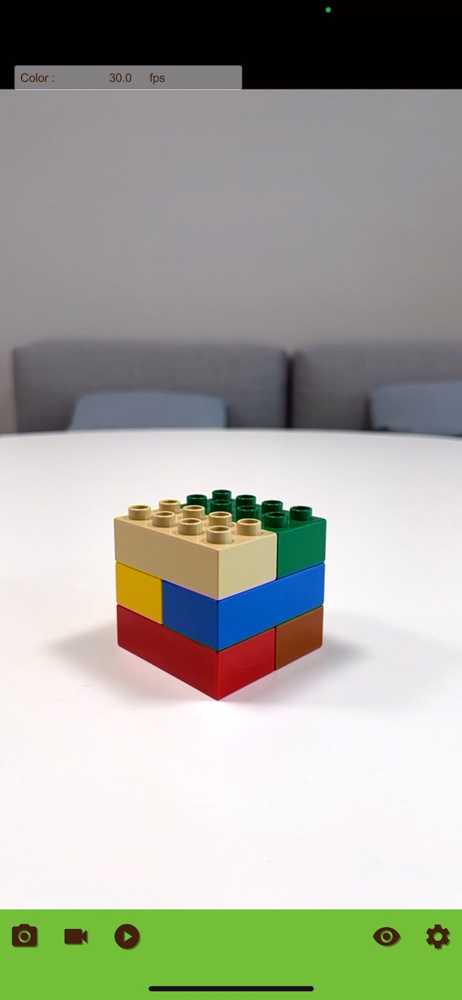</td>
    <td>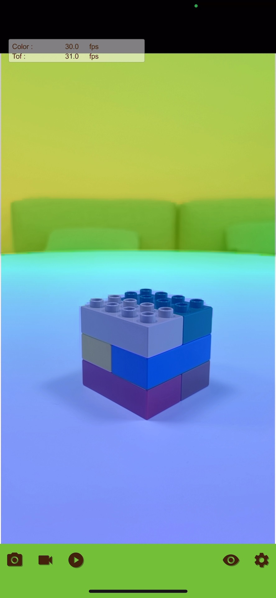</td>
    <td>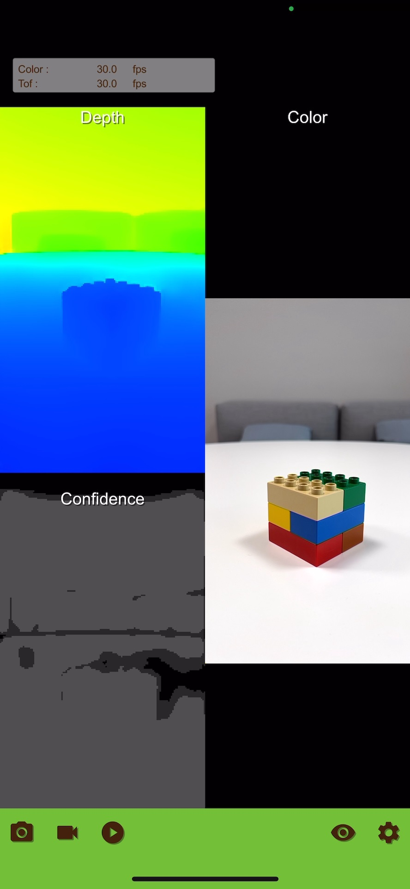</td>
    <td>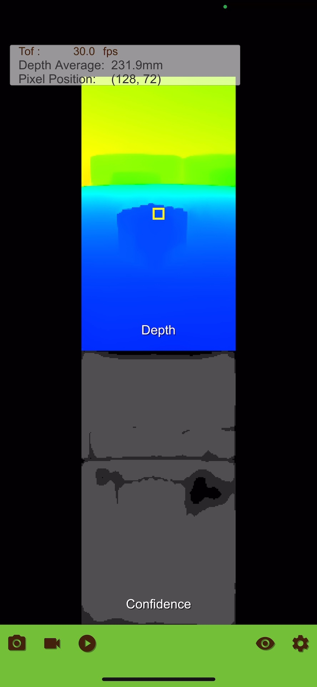</td>
</tr>
</table>

<table>
<tr align="center">
    <th width="250">PointCloud</th>
    <th width="250">ColoredPointCloud</th>
    <th width="250">HumanPointCloud</th>
    <th width="250">Segmentation</th>
</tr>
<tr align="center">
    <td>Display a subject as a single color PointCloud</td>
    <td>Display a subject as a color PointCloud</td>
    <td>Display a human body as a color PointCloud</td>
    <td>Display segmentation results for person and sky as masks</td>
</tr>
<tr align="center">
    <td>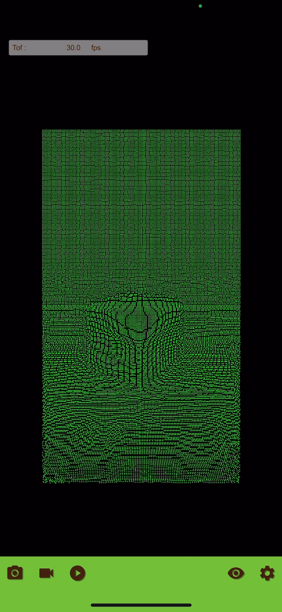</td>
    <td>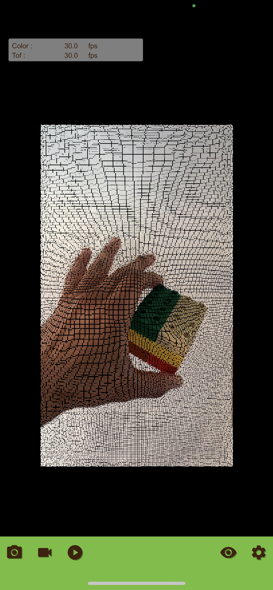</td>
    <td>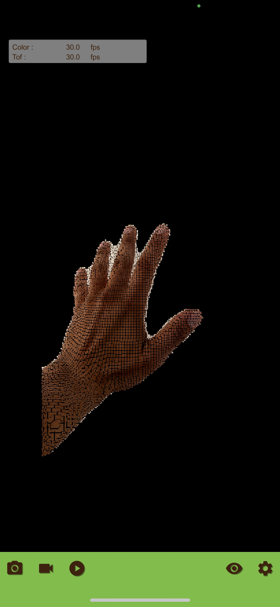</td>
    <td>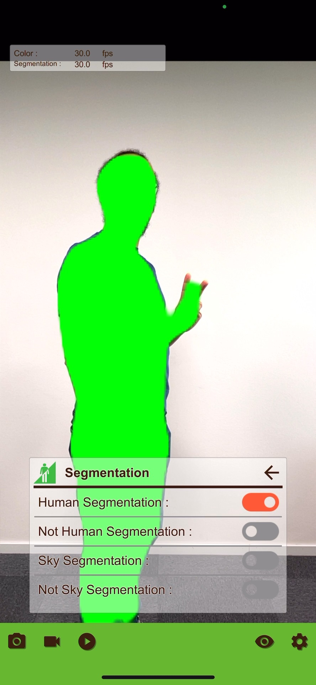</td>
</tr>
</table>

<table>
<tr align="center">
    <th width="250">Hand</th>
    <th width="250">LiveMeshOcclusion</th>
    <th width="250">ColorHandOcclusion</th>
    <th width="250">Body</th>
</tr>
<tr align="center">
    <td>Display a hand bone model</td>
    <td>Display a virtual cube occluded by the subject based on distance measurement</td>
    <td>Display a virtual cube occluded by the hand based on distance measurement, and display hand bone model</td>
    <td>Display a human bone model on the Depth image</td>
</tr>
<tr align="center">
    <td>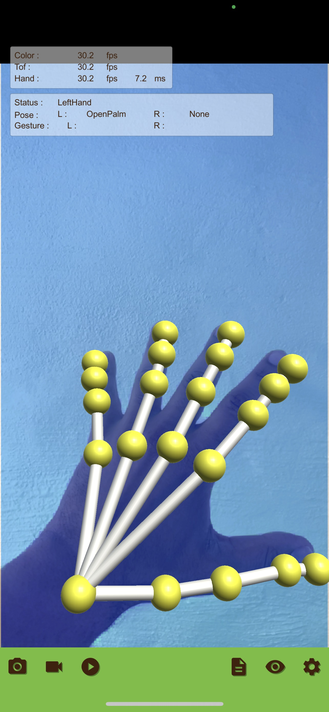</td>
    <td>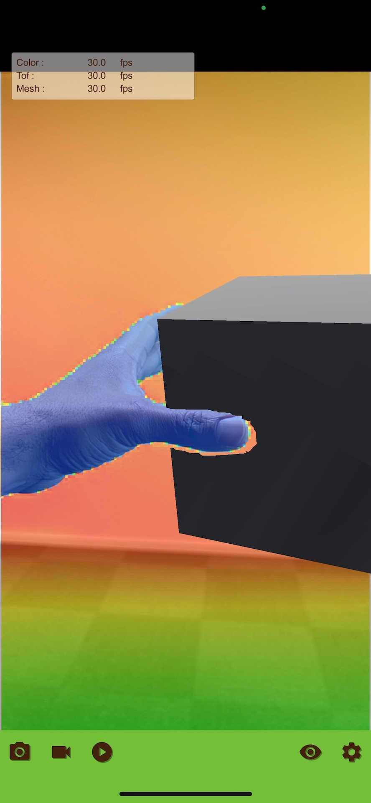</td>
    <td>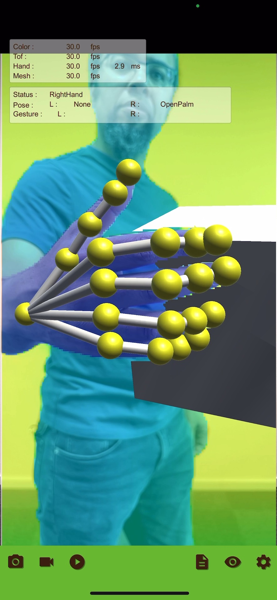</td>
    <td></td>
</tr>
</table>

<table>
<tr align="center">
    <th width="250">ColorBody</th>
    <th width="250">HandMark</th>
    <th width="250">ColorHandMark</th>
    <th width="250">SLAM</th>
</tr>
<tr align="center">
    <td>Display a human bone model on superimposed Depth and Color image</td>
    <td>Recognize the mark drawn with the index finger and display the mark name</td>
    <td>Recognize the mark drawn with the index finger and display the mark name. Superimpose Color image and Depth image.</td>
    <td>Display the coordinates of the SLAM-supported camera</td>
</tr>
<tr align="center">
    <td>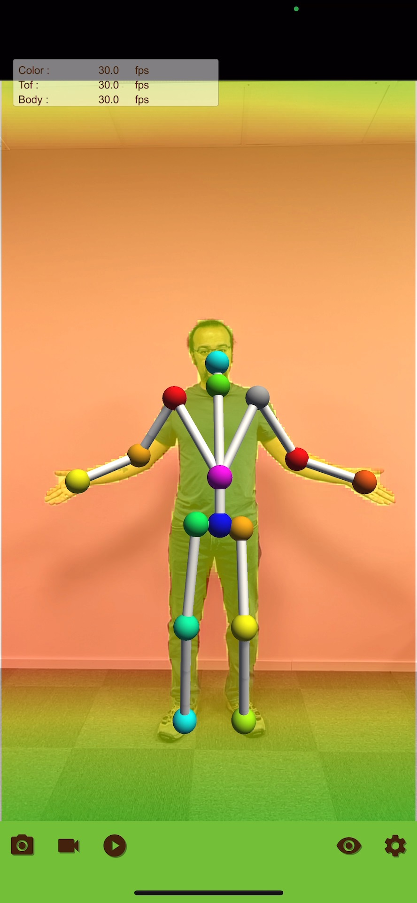</td>
    <td>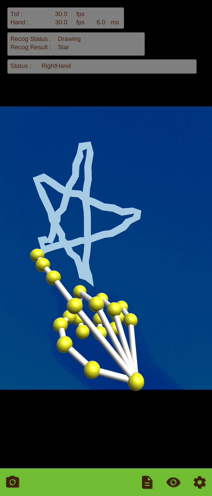</td>
    <td>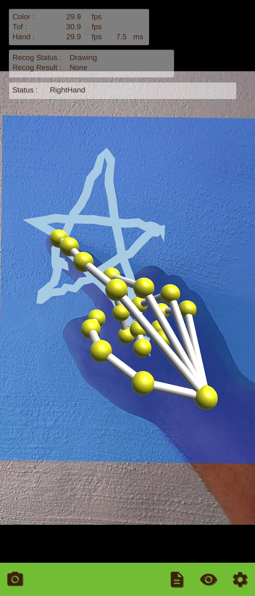</td>
    <td>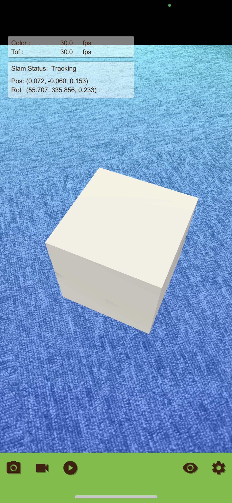</td>
</tr>
</table>

<table>
<tr align="center">
    <th width="250">Face</th>
    <th width="250">Plane</th>
    <th width="250">Recorder</th>
</tr>
<tr align="center">
    <td>Overlay a white mask on the face based on face recognition. Also display the recognition result from the shape of the mouth.</td>
    <td>Display a recognized Plane and vertical direction as an arrow.</td>
    <td>Save output data of selected components as images and CSV files.</td>
</tr>
<tr align="center">
    <td>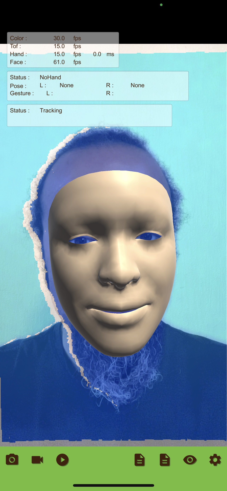</td>
    <td>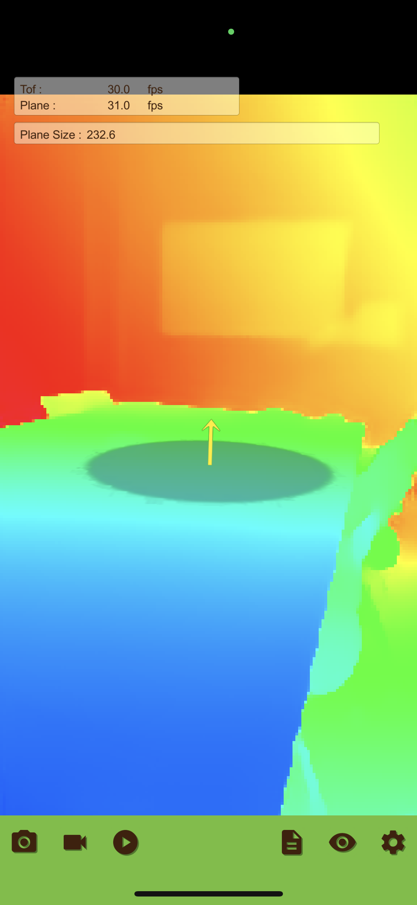</td>
    <td>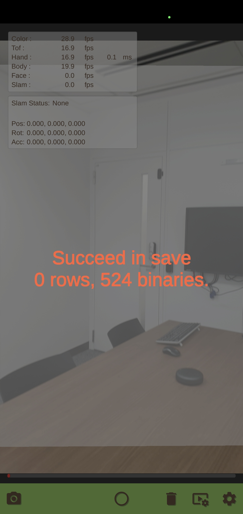</td>
</tr>
</table>

## Operation

Using the built application is described below.

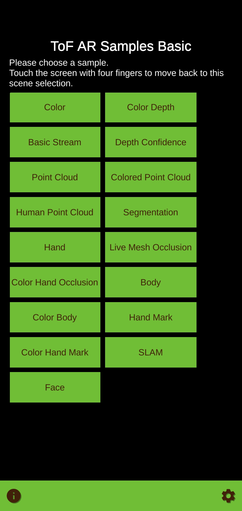

1. When you start the application, the scene list is displayed on the screen. 
Select a scene from the list and tap it to start it.

2. Tap the camera icon at the bottom left of the screen to display a list of available cameras for the selected scene. Select an appropriate camera, and the scene will start working.

3. Tap the screen with four fingers to return to the top screen.

# Component

The table below shows the relationships between the scenes in the sample application and the ToF AR components used by each scene. The scene names are arranged vertically and the component names are arranged horizontally. A check mark indicates that the component is used.

||ToF|Color|Mesh|Coordinate|Hand|MarkRecog|Body|Segmentation|Slam|Face|Plane|Modeling|
|:--|:-:|:-:|:-:|:-:|:-:|:-:|:-:|:-:|:-:|:-:|:-:|:-:|
|Color             |  |✓|  |  |  |  |  |  |  |  |  |  |
|ColorDepth        |✓|✓|  |✓|  |  |  |  |  |  |  |  |
|BasicStream       |✓|✓|  |  |  |  |  |  |  |  |  |  |
|DepthConfidence   |✓|  |  |  |  |  |  |  |  |  |  |  |
|PointCloud        |✓|  |  |  |  |  |  |  |  |  |  |  |
|ColorPointCloud   |✓|✓|  |✓|  |  |  |  |  |  |  |  |
|HumanPointCloud   |✓|✓|  |✓|  |  |  |✓|  |  |  |  |
|Segmentation      |  |✓|  |  |  |  |  |✓|  |  |  |  |
|Hand              |✓|✓|  |✓|✓|  |  |  |  |  |  |  |
|LiveMeshOcclusion |✓|✓|✓|✓|  |  |  |  |  |  |  |  |
|ColorHandOcclusion|✓|✓|✓|✓|✓|  |  |  |  |  |  |  |
|Body              |✓|  |  |  |  |  |✓|  |  |  |  |  |
|ColorBody         |✓|✓|  |✓|  |  |✓|  |  |  |  |  |
|HandHark          |✓|  |  |  |✓|✓|  |  |  |  |  |  |
|ColorHandMark     |✓|✓|  |  |✓|✓|  |  |  |  |  |  |
|SLAM              |✓|✓|  |  |  |  |  |  |✓|  |  |  |
|Face              |✓|✓|  |✓|✓|  |  |  |  |✓|  |  |
|Plane             |✓|  |  |  |  |  |  |  |  |  |✓|  |
|Recorder          |✓|✓|  |  |✓|  |✓|  |✓|✓|  |  |

# Assets

**ToF AR Samples Basic** provides the following assets. Assets include URP (Universal Render Pipeline) and VRM (Virtual Reality Model) for 3D characters and avatars.

### TofArSamplesBasic
Sample scene scripts and resources are stored for each component.

### TofArSettings
Prefabs and scripts are stored as the configuration change UI used by each component.

|File|Description|
|:--|:--|
|Settings.Prefab|Configuration change UI|
|XXXController.Prefab|Manage configuration changes for each component|

### URP（Universal Render Pipeline）

URP is the standard lightweight rendering pipeline of Unity for displaying scene content. URP is included in the asset.

Please see [Universal Render Pipeline documentation](https://docs.unity3d.com/Packages/com.unity.render-pipelines.universal@7.1/manual/index.html).

### VRM (Virtual Reality Model)
VRM is a platform-independent 3D avatar file format for humanoid characters and avatars. VRM is included in the asset.

Please see [VRM documentation](https://vrm.dev/en/vrm/vrm_about/).

# Development environment

## Build library

ToF AR is required for build. Download the ToF AR toolkit from [ToF AR official website](https://tof-ar.com/), then import it and use it in a Unity project.
Note that both Base and Hand components are required by ToF AR Server.

If the project is opened before ToF AR is set up, a confirmation message to enter safe mode may appear, depending on your settings.
If you start Unity in safe mode, exit safe mode and then import the ToF AR package.

## Documents

ToF AR Development documents are also available on the official website.

* [ToF AR user manual](https://tof-ar.com/files/2/tofar/manual_reference/ToF_AR_User_Manual_ja.html) for overview and usage
* [ToF AR reference articles](https://tof-ar.com/files/2/tofar/manual_reference/ToF_AR_Reference_Articles_ja.html) for articles about each component
* [ToF AR API references](https://tof-ar.com/files/2/tofar/manual_reference/reference_ja/reference/api/TofAr.V0.html)

## Verification environment

Operation was verified in the following environment:

* Unity Version  : 2021.3.31f1
* ToF AR Version : 1.4.0

# Notes

Be aware that recognizable hand gestures may have different meaning in countries/areas.  
Prior cultural checks are advisable.

# Contributing

**We cannot accept any Pull Request (PR) at this time.**
However, you are always welcome to report bugs and request new features by creating issues.

We have released this program as a sample app with a goal of making ToF AR widely available.
So please feel free to create issues for reporting bugs and requesting features, and we may update this program or add new features after getting feedback.
